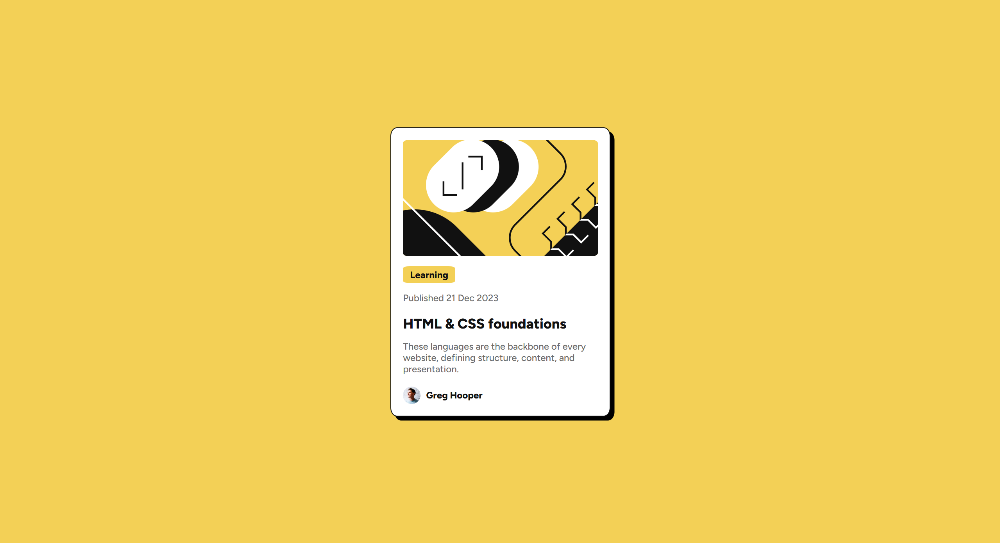

# Frontend Mentor - Blog Preview Card Solution

This is my solution to the [Blog Preview Card Challenge on Frontend Mentor](https://www.frontendmentor.io/challenges/blog-preview-card-ckPaj01IcS). 

## Table of Contents

- [Overview](#overview)
  - [Screenshot](#screenshot)
  - [Links](#links)
- [My Process](#my-process)
  - [Built With](#built-with)
  - [What I Learned](#what-i-learned)
  - [Continued Development](#continued-development)
  - [Useful Resources](#useful-resources)
- [Author](#author)
- [Acknowledgments](#acknowledgments)

## Overview

### Screenshot



### Links

- Solution URL: [GitHub Repository](https://github.com/jayco01/blog-preview-card.git)
- Live Site URL: [Live Preview](https://jayco01.github.io/blog-preview-card/)

## My Process

### Built With

- Semantic **HTML5**
- **CSS3**
- **Flexbox**
- Mobile-first workflow

### What I Learned

One key takeaway from this project was learning how to use the `:active` pseudo-class to change styles when an element is clicked. 
This helped me understand how user interactions can be styled dynamically.

Example of what I learned:
```css
h2:active {
    color: hsl(47, 88%, 63%);
}
```

### Continued Development

Going forward, I want to improve the naming of my CSS classes to make them more descriptive and easier for other developers to understand. 
Additionally, I want to improve my coding structure since my current code feels a bit messy, and I aim to make it more maintainable.

### Useful Resources

- [W3Schools](https://www.w3schools.com/) - Helped me understand how specific CSS functions work, especially pseudo-classes like `:active`.

## Author

- LinkedIn - [Jay Vincent Layco](https://www.linkedin.com/in/jay-vincent-layco-39184116b/)
